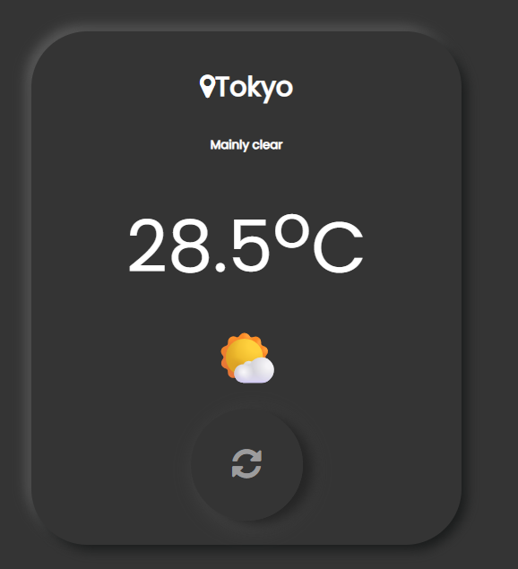

# Weather_App

A simple weather app that shows your local weather using Open-Meteo API with automatic location detection and Tokyo fallback—no API keys needed.

## Display


## Features

- Detects user location (with fallback to Tokyo)
- Displays city name, temperature, and weather condition
- Shows a suitable weather emoji
- Quick refresh button
- Clean, responsive UI

## Tech Stack

- HTML, CSS, JavaScript, jQuery
- Open-Meteo (weather data, no key)
- OpenStreetMap Nominatim (reverse geocoding, no key)
- Font Awesome (icons), Google Fonts (Poppins)

## Usage

1. Clone this repository:
    ```bash
    git clone https://github.com/YOUR-USERNAME/Weather_App.git
    ```
2. Change to the directory:
    ```bash
    cd Weather_App
    ```
3. Install dependencies (if you use any Node.js tools):
    ```bash
    npm install
    ```
4. Open `api.html` in your browser.

## Project Structure

```
api.html         # Main HTML file
api.css          # Styles
api.cjs          # JavaScript logic (or included in HTML)
package.json     # Node.js metadata and dependencies
package-lock.json# (optional) npm lockfile
node_modules/    # (ignored) third-party dependencies
```

## .gitignore

This project’s `.gitignore` should include:
```
node_modules/
```

## License

This project is open-source and free to use.
